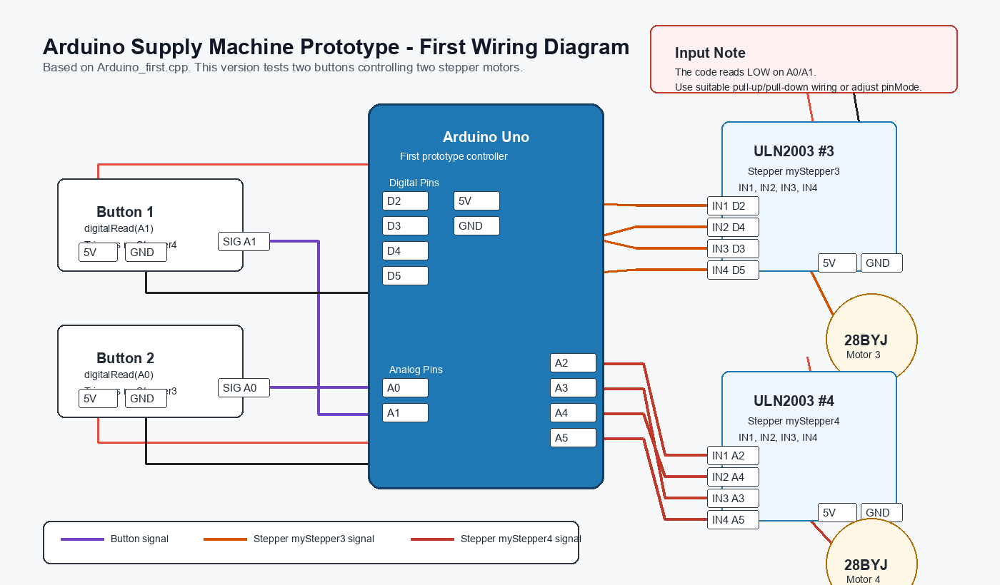
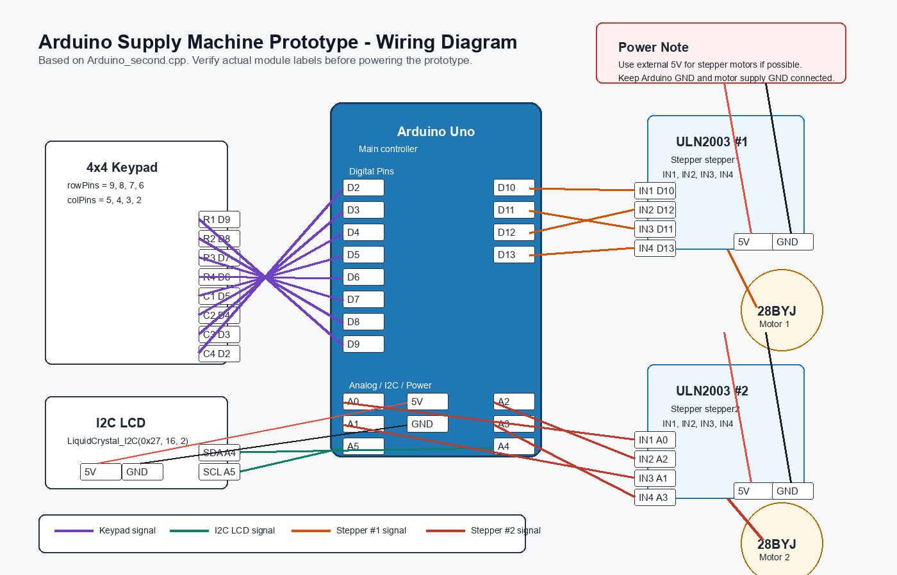

# arduino-supply-machine-prototype

A physical Arduino-based vending/supply machine prototype built with stepper motors, 3D-printed rails, keypad input, and an LCD interface. 

## Overview

This project is a 30 cm x 30 cm x 30 cm prototype supply machine. It was designed to dispense two small items, such as tissue paper and toilet-seat covers, using Arduino-controlled stepper motors and custom mechanical rails.

The project combines:

- Arduino C++ programming
- 28BYJ-48 stepper motor control through ULN2003 driver boards
- 4 x 4 keypad input
- I2C LCD user prompts
- 3D-printed rail mechanisms
- Breadboard wiring and power distribution
- Physical prototyping with cardboard housing

## Main Features

- Two-item dispensing mechanism using stepper motors
- Button-based control and keypad-based password
- LCD messages for user interaction
- Motorized open-and-close motion for the dispensing mechanism
- Modular code split across two Arduino prototype files

## Repository Structure

```text
.
|-- README.md
|-- requirements.md
|-- Arduino_first.cpp
`-- Arduino_second.cpp
```

## Files

`Arduino_first.cpp`

Initial prototype using two buttons to control two stepper motors. This version focuses on validating the motor movement, rail distance, and item-pushing mechanism.

`Arduino_second.cpp`

Expanded prototype using a 4 x 4 keypad, I2C LCD, and two stepper motors. This version adds a simple password flow, rotating LCD messages, and a timed close mechanism.

`requirements.md`

Hardware components, Arduino libraries, and setup notes.

## Hardware Summary

The prototype used Arduino Uno boards, 28BYJ-48 stepper motors, ULN2003 motor driver boards, a 4 x 4 keypad, an I2C LCD module, breadboards, jumper wires, and 3D-printed rails. The physical enclosure was built from cardboard during the prototype stage.

The project used multiple Arduino Uno boards because the power requirements of the motors and display were difficult to handle reliably from a single board during early testing.

## Project Media

This public repository currently documents the code, hardware list, and setup notes.

Version 1: button-controlled motor test



Version 2: keypad, LCD, and two-motor control



Editable vector versions are available at [docs/arduino_first_wiring_diagram.svg](docs/arduino_first_wiring_diagram.svg) and [docs/arduino_second_wiring_diagram.svg](docs/arduino_second_wiring_diagram.svg).

Prototype photos or a short demo video can be added later to make the physical build easier to inspect.

## Setup Notes

1. Install the Arduino IDE.
2. Install the required Arduino libraries listed in `requirements.md`.
3. Connect the stepper motors to the ULN2003 driver boards.
4. Match the driver board pins to the pin assignments in the code.
5. Connect the keypad and LCD according to the pin mappings in `Arduino_second.cpp`.
6. Upload the code to the Arduino board.
7. Test motor direction and rail distance before installing the mechanism inside the housing.

The value `10787` in the motor loops was calibrated for the prototype rail distance used in this build. It should be adjusted if the rail length, motor speed, or dispensing mechanism changes.

## What I Learned

This project helped me practice embedded programming, hardware debugging, pin mapping, motor calibration, and physical system integration. It also taught me that mechanical design and power delivery can be just as important as the code when building a working prototype.

## Limitations

This was a prototype, not a commercial vending machine. The password is a demonstration feature, the enclosure was built with simple materials, and the motor timing was calibrated manually for a specific physical setup. The rail system was purchased from an online shop.
